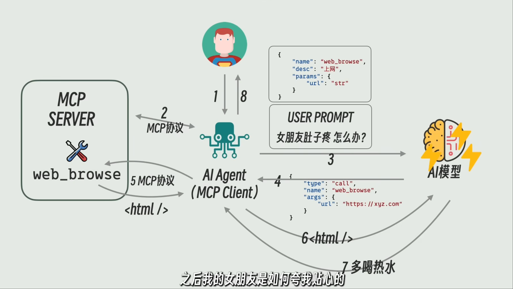

# agent

- ai LLM模型: 概率模型
- system prompt: 系统定制提示词
- user prompt: 用户输入的提示词
- agent tools: ai agent工具,例如,可以读取执行某个文件的程序或者指令,通用的功能被抽去变成服务,例如,读取文件,执行指令,翻译,搜索等
- agent: 负责用户和大模型之间沟通的媒介,可以借助agent tools
- mcp: 规范 agent tools 和 ai agent之间如何通信和交互, 所以 agent tools的服务被称为MCP SERVER; ai agent的接口被称为MCP CLIENT

```txt
        | system prompt |
用户 -》 | user prompt   | ->  LLM
            ai agent
```

system prompt: 系统定制提示词,会导致与大模型对话过程中多次重试,消耗大量的token, 后面大模型厂商推出Function Calling, 可以根据规定的格式返回,在大模型中进行重试,不用多次返回ai agent进行重试,从而节省token.但是新的问题产生了,不同的大模型厂家定义的格式不一致


